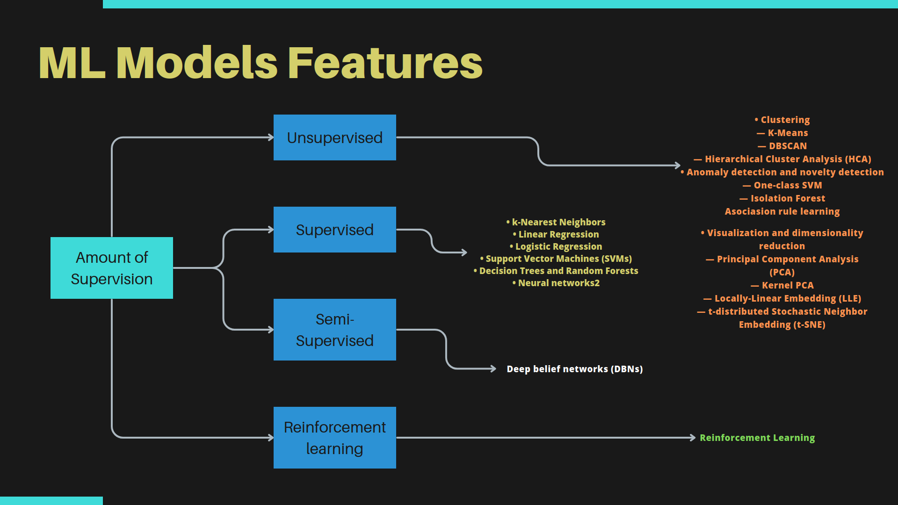
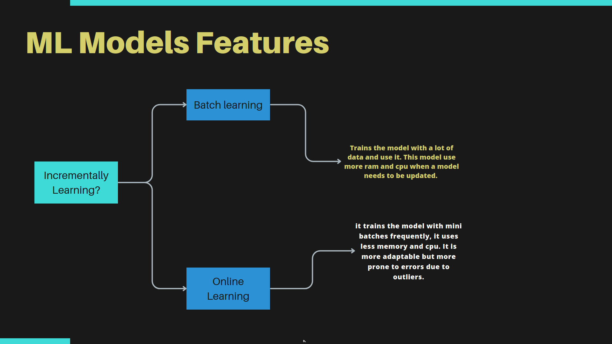
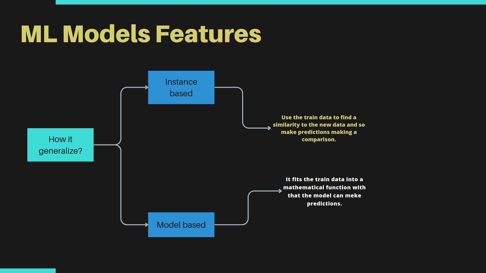

<h1 align='center'>Machine Learning</h1>

<h2>Overview</h2>

<h2>Linear regression</h2>
<pre>
#Model: supervised
#Trained with: (X,y)
#Prediction: continuous numbers
#Mathematical approach: least squares method, linear equation
#Performance test: r2_score
</pre>
<h2>Logistical regression</h2>
<pre>
#Model: supervised
#Trained with: (X,y)
#Prediction: continuous numbers (probability between 0,1)
#Mathematical approach: sigmoid fuction, linear equation
#Performance test:
</pre>

<h2>K-NN</h2>

<h2>Decision tree and random forest</h2>

<h2>Suport vector machines</h2>

<h2>K-means</h2>

<h2>DBscan</h2>

<h2>Anomaly and novalty detection</h2>

<h2>Kernel PCA</h2>

