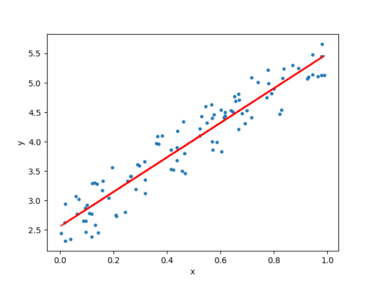
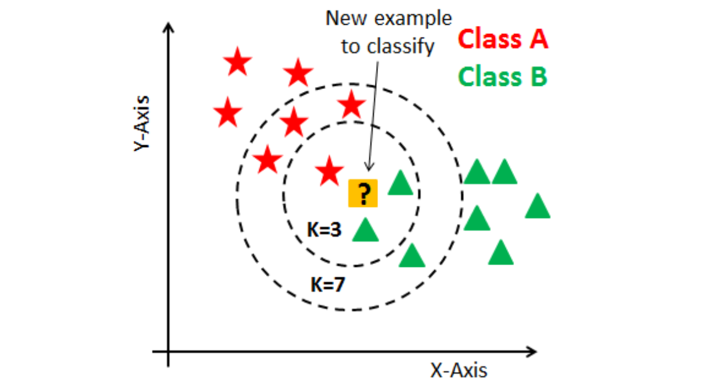

<h1 align='center'>Machine Learning</h1>

<h2>Classification</h2>
<li><b>Supervised</b>: It needs labeled examples to train (X,y)</li>
<li><b>Unsupervised</b>: It does not need a label to train (X)</li>
<li><b>Semi-supervised</b></li>
<li><b>Reinforcement</b>: It is a dinamic models where it learn from iterations, faults and success</li>
<li><b>Batch</b>: It uses a bunch of data and no more to train the model</li>
<li><b>Online</b>: The model learns from new data automaticaly all the time</li>
<li><b>Instance based</b>: It finds a data similarity and make predictions based in comparisons</li>
<li><b>Model based</b>: It uses a mathematical model to fit the data and make predictions</li>

&nbsp

<h2>Linear regression</h2>
<pre>
#Model: supervised
#Trained with: (X,y)
#Prediction: continuous numbers
#Mathematical approach: least squares method, linear equation
#Performance test: r2_score
</pre>

<h2>Logistical regression</h2>
<pre>
#Model: supervised
#Trained with: (X,y)
#Prediction: continuous numbers (probability between 0,1)
#Mathematical approach: sigmoid fuction, linear equation
#Performance test: model.score(X_test, y_test)
</pre>

<h2>K-NN</h2>
<pre>
#Model: supervised
#Trained with: (X,y)
#Hyperpameters: number of neighbours(K)
#Prediction: categories(labels, discrete numbers)
#Mathematical approach: euclidean distance (pythagory)
#Performance: model.score(X_test, y_test), metrics.accuracy_score(y_test, y_pred)
</pre>

<h2>SVM(support vector machine) and PCA(kernel)</h2>
<pre>
#Model: supervised
#Trained with: (X,y)
#Hyperpameters: C
#Prediction: Two categories (labels, discrete numbers) 
#Mathematical approach: simple and multidimensional lines, polynomics, kernel
#Performance: model.score(X_test, y_test), metrics.accuracy_score(y_test, y_pred)
</pre>

<h2>Decision tree and random forest</h2>

<h2>K-means</h2>

<h2>DBscan</h2>

<h2>Anomaly and novalty detection</h2>

